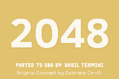

A port of 2048 for the GameBoy Advance [hosted on itch.io here](https://basil-termini.itch.io/2048-advance)

## Building

### nob
```sh
cc -o nob nob.c 
./nob # [options]
      # -r / run:       run in emulator after build  
      # -m / multiboot: build multiboot ROM
      # -d / debug:     define _DEBUG
      # example ./nob -md run   build multiboot, debug, and run 
```

### cmake
```sh
cmake -G Ninja -B build . 
cmake --build build
```

## Changelog

### v1.3.1
* Fixed a bug allowing input when 2048 has been achieved

### v1.3
+ Added nob build system alongside CMake
+ Separated score logic out from gameplay code into [score.c](source/score.c)
+ Added contributing guidelines (CONTRIBUTING.md)
+ Added huge merge sound effect
* Updated all sound effects (except slide / spawn sounds)
* Sound effects are now declared under SFX_LIST in [global.h](include/global.h) and statically defined automatically using x macros
* Redesigned scene system with SCENE_LIST and x macros - scenes are now implemented in [source/scenes](source/scenes)
* Fixed a graphical bug causing parts of squares to vanish with OAM sorting
* Fixed scale animations freezing while sliding animation is playing
* Fixed initial full scale frame in merge animation
* Scene change now occurs at the start of the next frame instead of at the call-site
* Modified CMake graphics pipeline to work with nob setup
* Upgraded storage format to v2 with hi-score backwards compatibility
* Reverted removal of .grit graphics config files 
* Changed .gitignore to a whitelist
- Reverted L+R+Select hi-score reset and last-save return from Game Over: will move to pause menu

### v1.2 contributed by [@carstene1ns](https://github.com/carstene1ns)
+ Implemented highscore resetting with L+R+Select on title screen.
+ Allow returning to last saved game from Game Over screen.
+ Allow running as Multiboot ROM
* Fixed playfield display on Game Over/Win screen
* Save battery with better vsyncing
* Stop tally animation when out of screen

### v1.1
+ Implemented saving: press start to save and the game will resume where you left off.
* Fixed score tallying
* Fixed error in gameover check
* Fixed while-loop hang save crash
